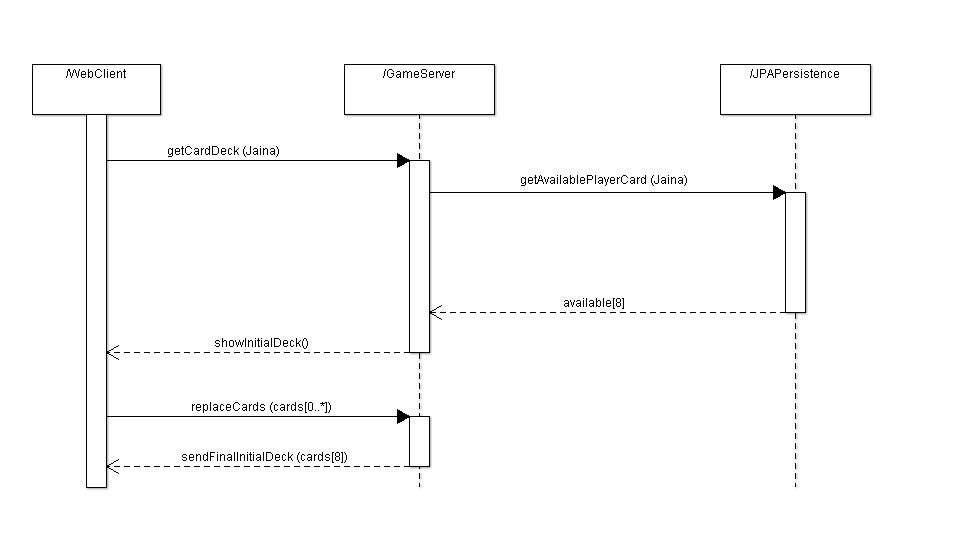
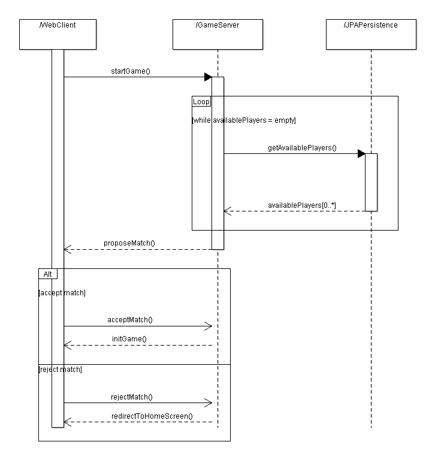
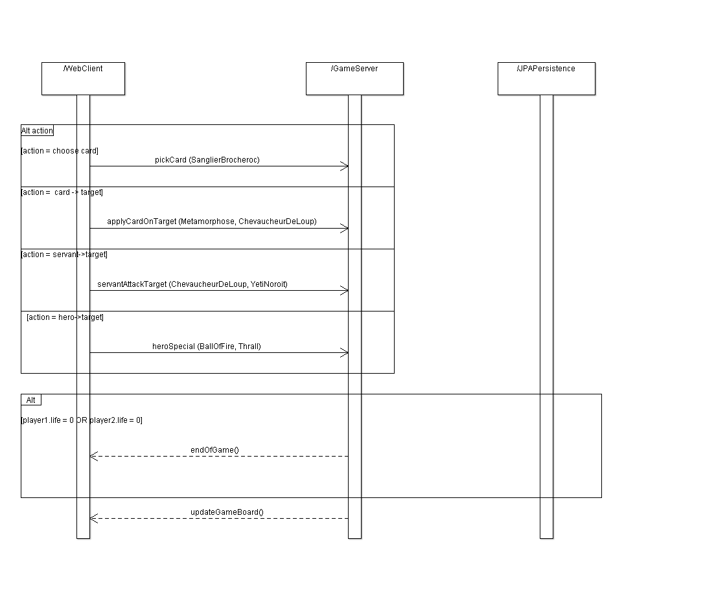

Benjamin Brault, Matthieu Gayraud, Roxane Maréchal, Apollon Viera

# Conception Preliminaire

## Table des matières
1. Division de la solution en différents composants
2. L'explication et spécification des interfaces fournies par chaque composant
3. Les diagrammes de séquences qui valident ces interfaces

## 1) Division de la solution en différents composants

## 2) L'explication et spécification des interfaces fournies par chaque composant

### 2.1. Interface fourni par le composant WebClient

* getCardDeck() récupére aléatoirement une carte du deck.
* replaceCards(cards) remplace une liste de cartes par d'autres cartes.
* startGame() appel le serveur de jeu pour rechercher une partie.
* acceptMatch() accepte le match proposé par le serveur de jeu.
* rejectMatch() refuse le match proposé par le serveur de jeu.
* pickCard(Card) pioche la carte Card.
* applyCardOnTarget(Card, Target) utilise le sort Card sur la cible Target.
* servantAttackTarget(Servant,Target) permet d'attaquer la cible Target avec 
le servant Servant.
* updateHeroXp(Hero) augmente l'expérience du client avec le héros Hero

### 2.2. Interface fourni par le composant GameServer

* showInitialDeck() donne la main de base, le joueur peut remplacer certaines cartes
de cette liste.
* sendFinalInitialDeck(cards) donne le deck initial qui ne peut être modifié.
(Réponse à l'appel de "getCardDeck")
* proposeMatch() propose un match a un joueur.
(Réponse à l'appel de "startGame()")
* getAvailablePlayerCard(HeroID) donne les cartes spéciales lié à un héros.
* initGame() initialise la partie.
* redirectToHomeScreen() redirige les joueurs à l'écran d'accueil.
* getAvailablePlayer() donne la liste des joueurs disponible pour jouer.
* endOfGame() termine la partie en cours.
* showHeroStatsInterface() donne les statistiques du héros.
* updateGameBoard() met à jour le plateau de jeu.
* dbUpdateHeroXP(Hero) met à jour l'xp lié au héros Hero.
(Réponse à l'appel de "updateHeroXp(Hero)")
* getFirstHand() retourne la main avec laquelle le joueur commence.

### 2.3. Interface fourni par le composant JPAPersistence 

* availableCards() donne la liste des cartes disponibles
* queryFetchPlayerCards() récupère la liste des cartes utilisable par le joueur
* queryUpdateHeroXP(Hero) augmente l'xp lié au héros dans la BDD

## 3) Les diagrammes de séquences qui valident ces interfaces

Nous avons fait un diagramme de séquence par scénario afin de distinguer les différents cas d'intéractions possibles.
Nous n'avons pas représenté les messages liés au feeback car nous avons considéré que cela est géré au niveau du *WebClient*. 
Par exemple : si un joueur essaie de choisir une carte mais il n'a pas assez de mana pour celle-ci, la première vérification se fait au niveau du *WebClient* pour notifier au joueur qu'il n'a pas assez de mana. 
Mais il vrai qu'il n'est pas très sécurisé d'effectuer les vérifications uniquement côté client car les clients peuvent tricher. Il est donc nécéssaire de faire une double vérification des préconditions côté *GameServeur*, mais nous ne les avions pas représentés dans les diagrammes de séquences afin de ne pas les alourdir.  

### 3.1. Scénario : Récupération du premier 'Main de cartes'

Ce scénario illustre l'intéraction entre les 4 composants lorsque le *WebClient* demande au *GameServer* de générer son premier *'main de cartes'*.

Les cartes qui sont disponibles pour le héros choisit, sont stockées dans la bases de données.

Une fois la requête exécuté, JPA renvoie au GameServer les différents cartes disponibles pour ce héros sous forme de *liste*. Le *GameServeur* fait générer ensuite la main de cartes aléatoire à partir de *'List availableCards'* et le renvoie au *WebClient*.

### 3.2. Scénario : Demander le démarrage d'une partie et matchmaking aléatoire

Ce scénario illustre l'intéraction lorsqu'un joueur demande à entrer dans une partie.
Lorsqu'un joueur demande à entrer dans une partie, le *WebClient* doit demander au *GameServeur* de récupérer la liste des joueurs en lignes *qui ne sont pas dans une partie* via *getAvailablePlayers()* de la base de données via JPAPersistence. 

JPAPersistence récupère le résultat de la requête et renvoie l'envoie sous forme de liste au *GameServeur* : *List availablePlayers*. Le *GameServeur* tire un des joueurs de la liste aléatoirement et propose le match au *WebClient*.

Le *WebClient* peut soit accepter ou rejecter me match. 

### 3.3. Scénario : Différentes actions possibles lors d'un tour

Ce scénario illustre les différentes actions possible que peut effectuer un joueur et les différentes données transmises au *GameServeur* en fonction de ses choix. Si les points de vie d'un des joueur vaut 0 alors c'est la fin de la partie et le *GameServeur* gère la demande de sauvegarde des points d'expériences acquis lors de la partie en bases de données. Lorsque ces données ont été correctemet sauvegardées en bases de données, le *GameServeur* met à jour l'interface du *WebClient* afin de montrer au joueur les statistiques de son héros. 

On aurait pu créer un diagramme de séquence par action au lieu de mettre un *"alt"* pour chaque action dans le diagramme. Mais nous avons décidé de mettre tout cela en un seul diagramme car, nous ne voyons pas d'autre intéraction particulière entre le *WebClient* et le *GameServer* lors d'une prise d'action, mise à part le *WebClient* qui envoie une action au *GameServeur* et le *GameServeur* qui lui répond en mettant à jour le plateau du jeu. 

La seule autre intéraction que nous pouvons imaginer qui peut différer lors d'une prise d'action, c'est un cas de triche qui n'est donc pas détecté par le *WebClient* mais qui est vérifié et géré par le *GameServeur* qui va "réinitialiser" le plateau du joueur 'tricheur' tel qu'il devrait l'être. 

### 3.4. Scénario : Attente de mon tour

Dans ce scénario, on considère qu'on est le joueur1 et que le joueur2 est en train de jouer. Le *WebClient* contient une variable booleénne **isMyTurn**. Tant que celle-ci vaut *false* le *WebClient* demande continuellement au *GameServeur* si c'est son tour. Tant que le *joueur1* est en attente, le *WebClient* est obligé de demander continuellement si c'est son tour, car le *WebClient* connaît le *GameServeur* mais le *GameServer* ne connaît pas de client. On a donc une* association unidirectionel* du *WebClient* vers le GameServer. Cela veut dire que le *GameServer* ne peux pas envoyer de message au *WebClient*, il peut seulement lui répondre. Donc dès que le *joueur2* termine son tour, le *GameServer* est incapable de donner lui-même la main au *joueur1*. D'où la nécéssité du *WebClient* du *joueur1* de devoir demander en continue si c'est son tour. 

